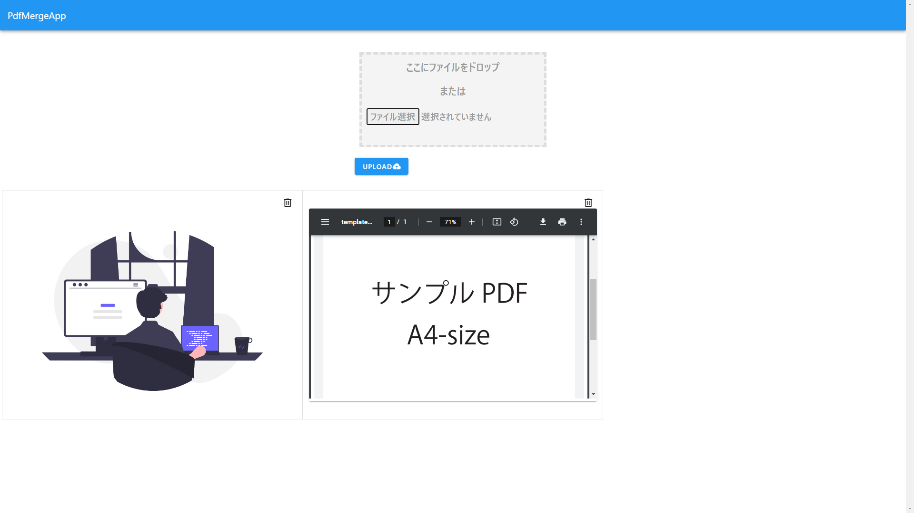
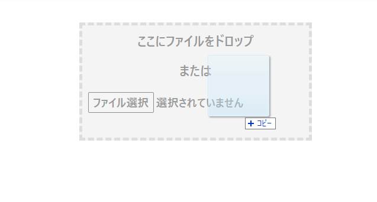
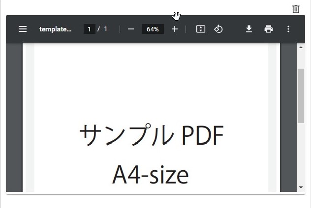
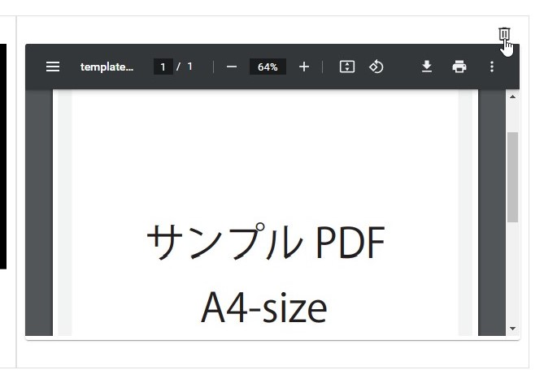
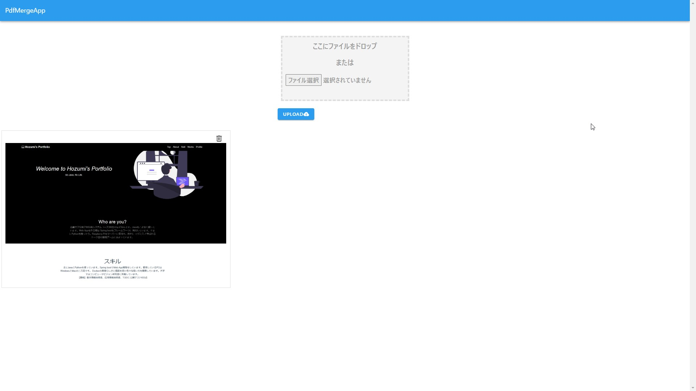

# PDF Merge App

# 概要
本アプリは、複数のPDFファイルを結合することができるアプリです。「jpegやpngを一括でpdfに変換・結合を行ってくれるWeb Appがないなあ」と不便に感じた経験から開発しました。

以下の機能があります。
- pdfファイルの結合
- jpeg/pngファイルのpdf化
- 画像のプレビュー
  - プレビューをドラッグして、結合の順番を入れ替えることが可能
  - プレビューからアップした画像の取り消し

# 使い方
## 1. ファイルをドラッグアンドドロップ

## 2. アップロードボタンをクリック

## 3. ダウンロードフォルダに自動で、結合ファイルが保存される
[結合されたpdfの例](/fig/yGn7U9TLll.pdf)

## その他

### プレビュ―をドラッグして結合の順番を変更

### プレビューからアップロードの取り消し

# 使用技術
## フロントエンド
- Vue.js
- Vuetify

## バックエンド
- FastAPI (Python)
